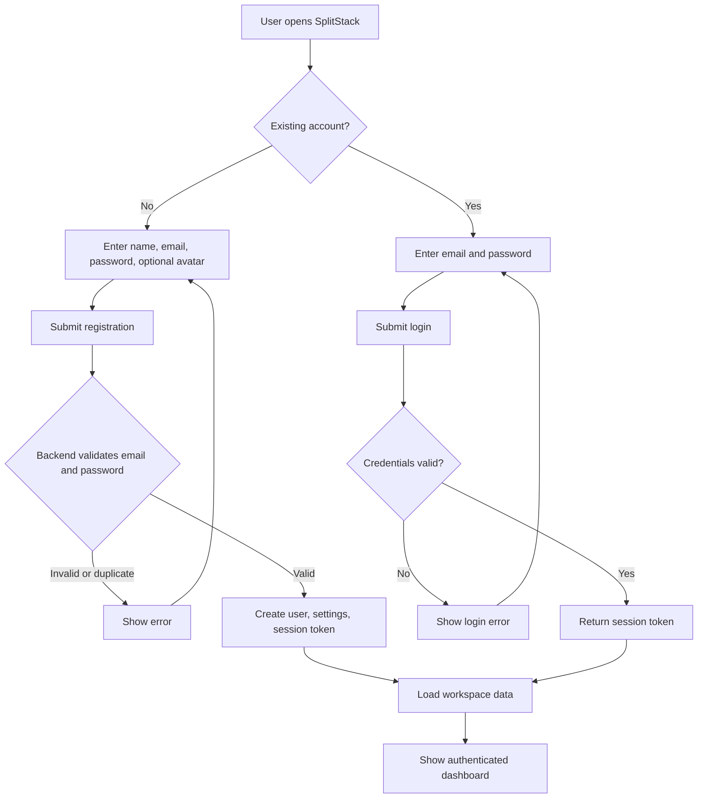
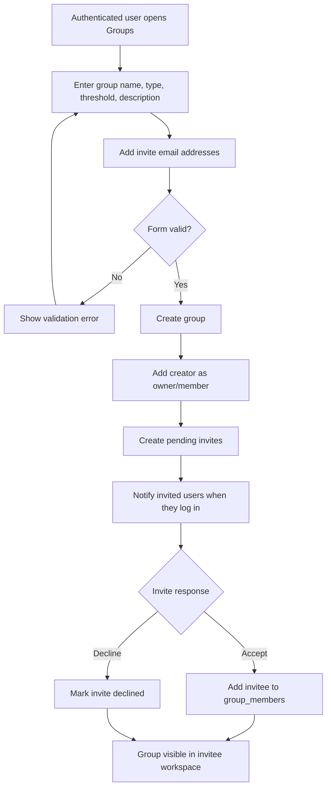
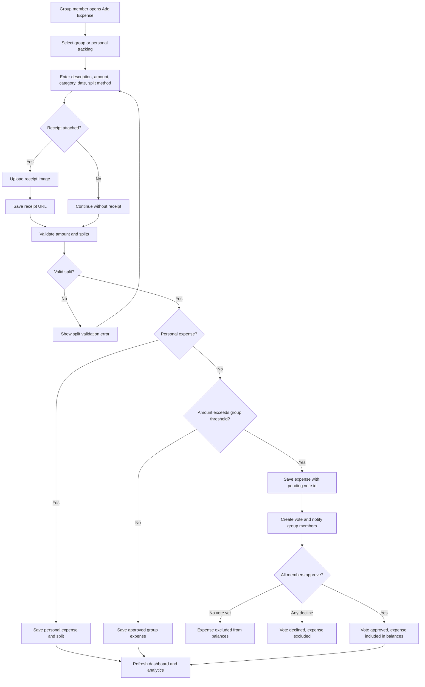
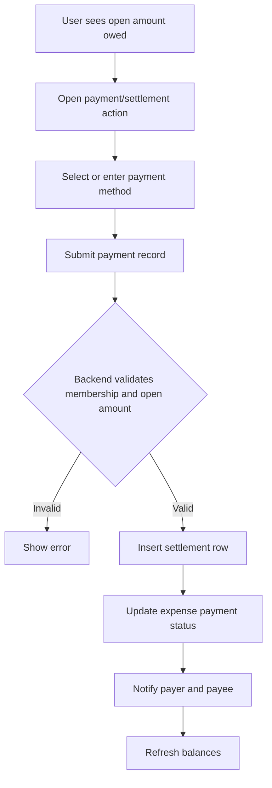
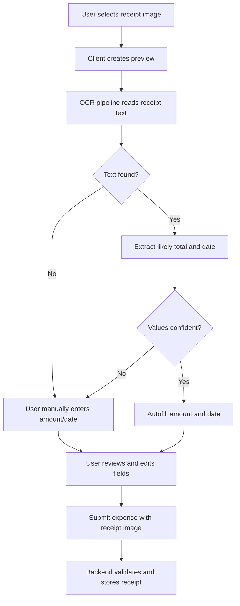
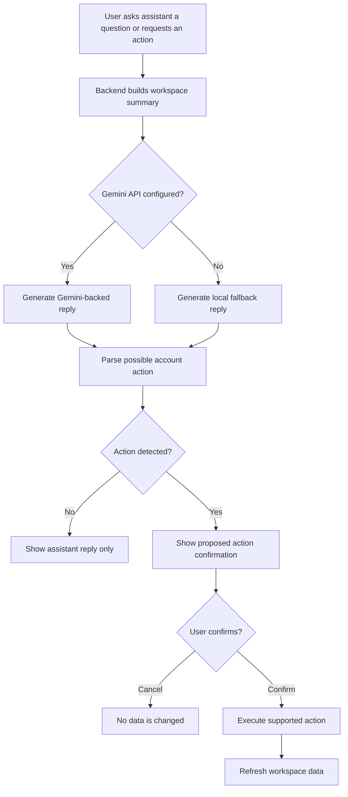
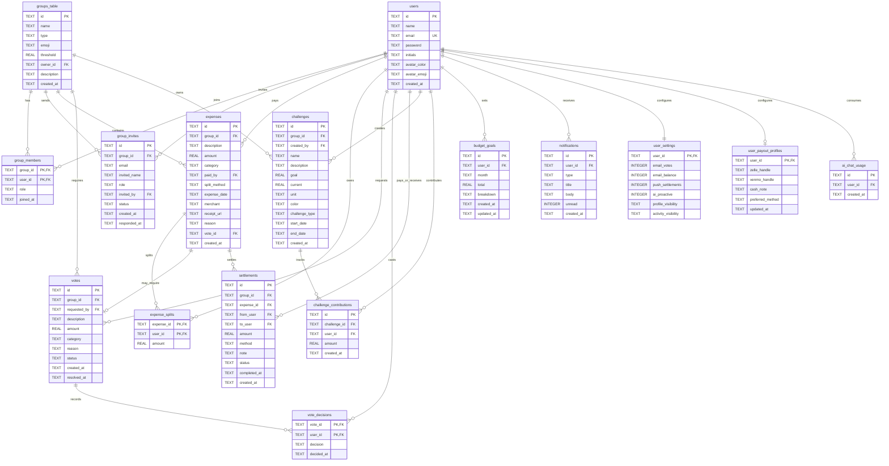

# SplitStack Functional Design Diagrams

Version: 1.0  
Date: May 12, 2026  
Related documents: `planning files/Project_Requirements_Specification (2).docx`, `planning files/SplitStack_Use_Cases (1) (3).docx`

## Overview

These diagrams support the requirements and use-case files with activity flows plus a domain/ER model for the implemented SplitStack system.

## Activity Diagram: Register and Log In

## Activity Diagram: Create Group and Invite Members

## Activity Diagram: Add Expense and Apply Voting Rule

## Activity Diagram: Record Settlement

## Activity Diagram: Receipt OCR-Assisted Expense Entry

## Activity Diagram: AI Assistant Confirmed Action

## Domain ER Diagram

## Domain Object Summary

| Object | Purpose |
| --- | --- |
| User | Account identity, profile, avatar, and authentication owner. |
| Group | Shared workspace with type, threshold, owner, and description. |
| GroupMember | Membership and role assignment for a user in a group. |
| GroupInvite | Pending or completed invitation to join a group. |
| Expense | Recorded purchase, personal cost, or shared group cost. |
| ExpenseSplit | Per-user amount owed for an expense. |
| Vote | Voting workflow for above-threshold expenses. |
| VoteDecision | A member's yes/no response to a vote. |
| Settlement | Recorded payment against an outstanding expense amount. |
| Challenge | Group savings/spending goal with progress. |
| ChallengeContribution | User contribution toward a challenge. |
| BudgetGoal | User monthly budget and category breakdown. |
| Notification | In-app event message for invites, votes, balances, and challenges. |
| UserSettings | Notification and privacy preferences. |
