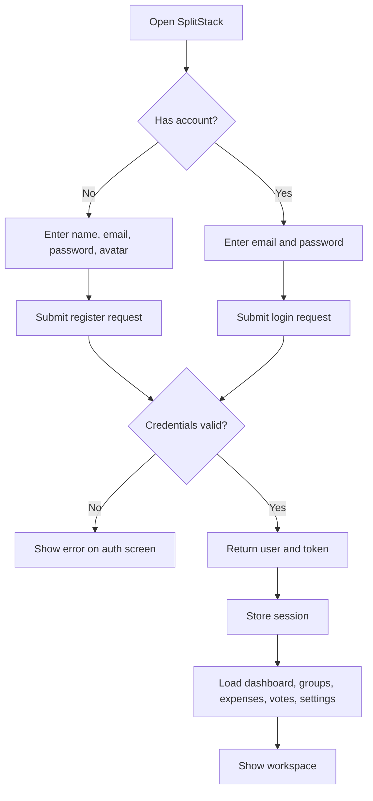
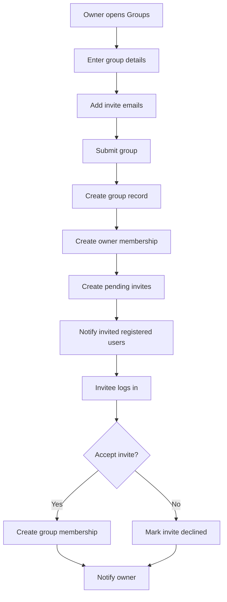
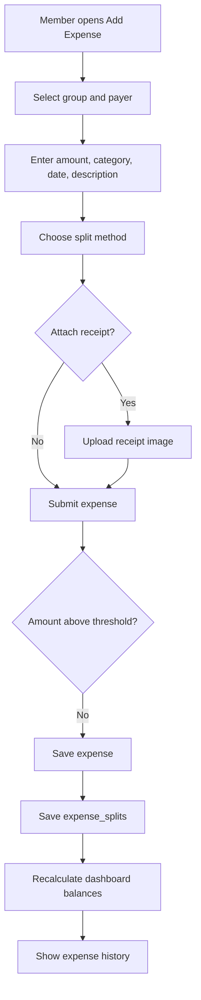
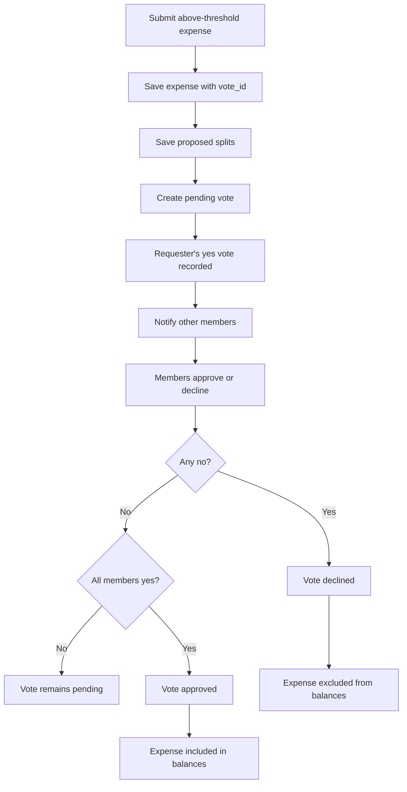
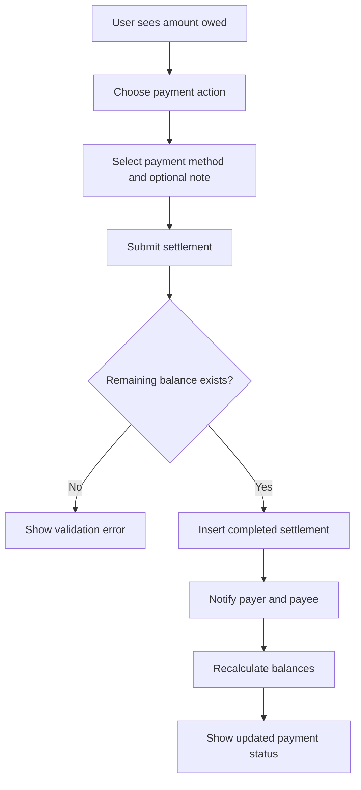
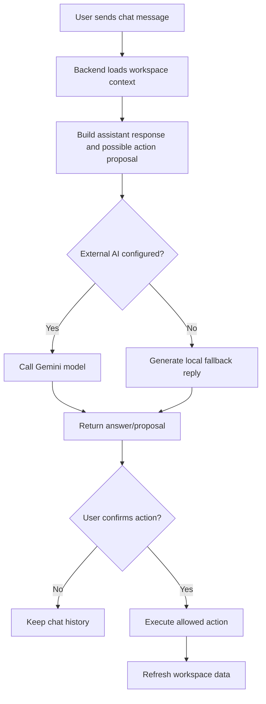
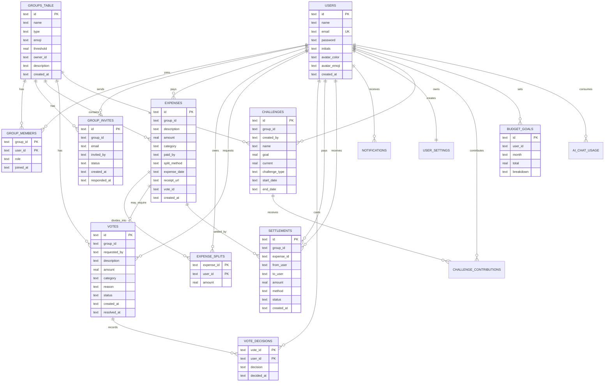

# SplitStack Functional and Requirements Specification

Version: 1.0  
Date: May 2026  
Role Focus: Business Analyst  
Project: SplitStack shared expense management app

## 1. Overview

These requirements match the implemented system in `website/backend`, `website/frontend`, and `mobile-app`.

## 2. Product Overview

SplitStack helps groups manage shared finances. Users create accounts, form groups, invite members, log expenses, split costs, vote on large purchases, settle balances, view analytics, manage challenges, and ask an AI assistant questions about live workspace data.

## 3. Actors

| Actor | Description |
| --- | --- |
| Guest | Unauthenticated person who can register or log in. |
| Group Member | Authenticated user who belongs to one or more groups and can add expenses, vote, settle, and view dashboards. |
| Group Owner/Admin | Group member with elevated group control such as editing or deleting a group and inviting members. |
| AI Assistant | System feature that answers questions and proposes confirmable actions based on workspace data. |
| OCR / Receipt Capture Service | Browser/mobile OCR helper and upload pipeline for receipt images. |
| Notification Service | In-app notification mechanism for invites, votes, balances, settlements, and challenges. |

## 4. Functional Requirements

| ID | Requirement | Priority | Implemented Evidence |
| --- | --- | --- | --- |
| FR-01 | Users can register, log in, log out, and access an authenticated workspace. | Must | `authService.js`, `authController.js`, React auth form, Flutter auth screen. |
| FR-02 | Users can create, edit, delete, leave, and list groups. | Must | `groupService.js`, `/api/groups`, React Groups page, Flutter group controls. |
| FR-03 | Group owners can invite members by email, and invited users can accept or decline. | Must | `group_invites`, `/api/invites`, invite notifications. |
| FR-04 | Users can create expenses with amount, description, category, date, group, payer, split method, and optional receipt. | Must | `expenseService.js`, `/api/expenses`, `/api/receipts`. |
| FR-05 | Expenses can be split equally, by percentage, or by custom member amounts. | Must | `expense_splits`, React split controls, Flutter split controls. |
| FR-06 | Expenses above a group threshold create a pending vote and do not affect balances until approved. | Must | `votes`, `vote_decisions`, `createExpense`, `respondToVote`. |
| FR-07 | Members can approve, decline, or undo pending votes. | Must | `/api/votes/:id/respond`, `DELETE /api/votes/:id/respond`. |
| FR-08 | Users can view dashboard balances, totals owed, people summaries, and pending vote counts. | Must | `dashboardService.js`, `calculateBalances`. |
| FR-09 | Users can record settlements for outstanding expense shares. | Must | `settlements`, `/api/expenses/:id/settlements`. |
| FR-10 | Users can view analytics by category, month, top expenses, and frequency. | Should | `analyticsService.js`, `/api/analytics`. |
| FR-11 | Users can set and save monthly budget goals. | Should | `budget_goals`, `budgetController.js`. |
| FR-12 | Users can create savings/spending challenges and add contributions. | Should | `challengeService.js`, `/api/challenges`. |
| FR-13 | Users can view and mark notifications as read. | Should | `notifications`, `/api/notifications`. |
| FR-14 | Users can update account, notification, and privacy settings. | Should | `user_settings`, `/api/settings`, `/api/me`. |
| FR-15 | Users can ask the AI assistant questions and confirm proposed actions. | Should | `assistantService.js`, `assistantActionService.js`, `/api/ai/chat`. |
| FR-16 | Users can upload receipt images and attach saved receipt URLs to expenses. | Should | `receiptService.js`, web upload panel, mobile image picker/OCR flow. |

## 5. Non-Functional Requirements

| ID | Requirement | How It Is Checked |
| --- | --- | --- |
| NFR-01 | Usability | A new user can register, create a group, add an expense, and view balances without code changes. |
| NFR-02 | Performance | Local API actions return quickly for classroom/demo data volumes. |
| NFR-03 | Reliability | App handles missing AI key by returning local assistant summaries instead of failing the workspace. |
| NFR-04 | Data Integrity | Expenses and expense splits are stored separately; balances are calculated from persisted ledger data. |
| NFR-05 | Security | Authenticated routes require bearer-token middleware; group operations require membership or ownership. |
| NFR-06 | Portability | App runs locally using Node.js, npm, SQLite, and Flutter without external database setup. |
| NFR-07 | Maintainability | Backend is separated into routes, controllers, services, database bootstrap, and middleware. |

## 6. Use Cases

### UC-01: Create Account and Authenticate

| Field | Details |
| --- | --- |
| Primary Actor | Guest |
| Goal | Create an account or log into an existing account. |
| Preconditions | App is running. |
| Trigger | User submits registration or login form. |
| Main Flow | User enters credentials; system validates; system returns user data and token; client stores session; workspace loads. |
| Alternate Flow | Invalid credentials return an error and user remains on auth screen. |
| Postconditions | Authenticated user can access protected workspace data. |
| Related Requirements | FR-01 |

### UC-02: Create and Manage Group

| Field | Details |
| --- | --- |
| Primary Actor | Group Owner/Admin |
| Goal | Create or update a shared expense group. |
| Preconditions | User is authenticated. |
| Trigger | User submits group form. |
| Main Flow | User enters name, type, threshold, description, invites; system creates group; system adds owner as member; system creates pending invites. |
| Alternate Flow | Duplicate quick resubmission reuses the recent group and adds missing invites. |
| Postconditions | Group appears in the owner's group list. |
| Related Requirements | FR-02, FR-03 |

### UC-03: Join Existing Group

| Field | Details |
| --- | --- |
| Primary Actor | Group Member |
| Goal | Accept or decline a group invitation. |
| Preconditions | User email matches a pending invite. |
| Trigger | User responds to invite. |
| Main Flow | System updates invite status; accepted invite creates group membership; owner receives notification. |
| Alternate Flow | Declined invite notifies owner and does not create membership. |
| Postconditions | Invite is no longer pending for that user. |
| Related Requirements | FR-03, FR-13 |

### UC-04: Log Expense with Split Options

| Field | Details |
| --- | --- |
| Primary Actor | Group Member |
| Goal | Add a shared expense to a group. |
| Preconditions | User belongs to at least one group. |
| Trigger | User submits add expense form. |
| Main Flow | User enters expense details; chooses split method; optionally attaches receipt; system saves expense and splits. |
| Alternate Flow | If amount exceeds threshold, system creates a vote and withholds the expense from balances until approved. |
| Postconditions | Expense is stored, or a pending vote is created. |
| Related Requirements | FR-04, FR-05, FR-06, FR-16 |

### UC-05: Vote on Proposed Expense

| Field | Details |
| --- | --- |
| Primary Actor | Group Member |
| Goal | Approve or decline an above-threshold expense. |
| Preconditions | Pending vote exists for a group the user belongs to. |
| Trigger | User selects approve or decline. |
| Main Flow | System records decision; unanimous yes approves; any no declines; requester receives notification. |
| Alternate Flow | User can undo while vote remains pending. |
| Postconditions | Approved vote makes linked expense count toward balances; declined vote excludes it. |
| Related Requirements | FR-06, FR-07 |

### UC-06: View Dashboard and Balances

| Field | Details |
| --- | --- |
| Primary Actor | Group Member |
| Goal | Understand current financial position. |
| Preconditions | User is authenticated. |
| Trigger | User opens Home dashboard or refreshes workspace. |
| Main Flow | System loads groups, approved expenses, splits, settlements, votes, analytics, and notifications. |
| Postconditions | User sees net balance, owed-to-you, you-owe, pending votes, and recent activity. |
| Related Requirements | FR-08, FR-10, FR-13 |

### UC-07: Settle Outstanding Balance

| Field | Details |
| --- | --- |
| Primary Actor | Group Member |
| Goal | Record payment toward an expense owed to another member. |
| Preconditions | User owes money on an approved expense. |
| Trigger | User selects payment method and submits settlement. |
| Main Flow | System validates remaining amount; inserts completed settlement; sends notifications; balances recalculate. |
| Postconditions | Expense payment status and dashboard balances update. |
| Related Requirements | FR-09 |

### UC-08: Create and Contribute to Challenge

| Field | Details |
| --- | --- |
| Primary Actor | Group Member |
| Goal | Create a group challenge and track progress. |
| Preconditions | User belongs to group. |
| Trigger | User submits challenge form or contribution amount. |
| Main Flow | System creates challenge; members receive notification; contributions update current progress. |
| Postconditions | Challenge appears with progress ring and contribution history. |
| Related Requirements | FR-12 |

### UC-09: View Analytics and Budget

| Field | Details |
| --- | --- |
| Primary Actor | Group Member |
| Goal | Understand spending totals and budget status. |
| Preconditions | User has expenses or a budget goal. |
| Trigger | User opens Analytics or budget card. |
| Main Flow | System aggregates user share by category, month, top expenses, and budget breakdown. |
| Postconditions | User sees spending summaries and saved budget goal. |
| Related Requirements | FR-10, FR-11 |

### UC-10: Chat with AI Assistant

| Field | Details |
| --- | --- |
| Primary Actor | Group Member |
| Secondary Actor | AI Assistant |
| Goal | Ask questions or request supported workspace actions. |
| Preconditions | User is authenticated. |
| Trigger | User sends a chat message. |
| Main Flow | System builds workspace context; assistant returns answer or action proposal; user can confirm supported actions. |
| Alternate Flow | If Gemini is unavailable, system returns local summary/advice. |
| Postconditions | User receives response; confirmed actions update workspace data. |
| Related Requirements | FR-15 |

### UC-11: Update Settings and Notifications

| Field | Details |
| --- | --- |
| Primary Actor | Group Member |
| Goal | Manage preferences and notification read state. |
| Preconditions | User is authenticated. |
| Trigger | User changes settings or marks notification read. |
| Main Flow | System saves settings and updates notification unread flag. |
| Postconditions | Preferences and unread count reflect the change. |
| Related Requirements | FR-13, FR-14 |

## 7. Activity Diagrams

### Account Authentication Activity

### Group Invite Activity

### Expense Below Threshold Activity

### Expense Vote Activity

### Settlement Activity

### AI Assistant Activity

## 8. Domain Object Model

| Domain Object | Responsibility |
| --- | --- |
| User | Represents a registered person with identity, credentials, initials, avatar, and settings. |
| UserSettings | Stores notification and privacy preferences. |
| Group | Represents a shared expense workspace with type, owner, threshold, and description. |
| GroupMember | Links users to groups with a role. |
| GroupInvite | Tracks invited emails, statuses, inviter, and response time. |
| Expense | Represents a purchase or payment event with amount, category, payer, date, receipt, and optional vote. |
| ExpenseSplit | Stores the amount owed by each user for an expense. |
| Vote | Represents approval workflow for an above-threshold expense. |
| VoteDecision | Records one member's yes/no decision for a vote. |
| Settlement | Records payment from one user to another for an outstanding expense. |
| Notification | Stores in-app alert title, body, type, unread state, and timestamp. |
| Challenge | Represents a group goal or spending challenge. |
| ChallengeContribution | Records a user's contribution to a challenge. |
| BudgetGoal | Stores monthly budget total and category breakdown for a user. |
| AiChatUsage | Tracks assistant usage entries. |

## 9. ER Diagram

## 10. Business Rules

| ID | Rule |
| --- | --- |
| BR-01 | A user must be authenticated to access all routes except health, register, and login. |
| BR-02 | A user can only see group data for groups where they are a member. |
| BR-03 | A group owner cannot leave their own group; they must delete the group or transfer ownership outside current scope. |
| BR-04 | Pending group invites are matched by invite email and user email. |
| BR-05 | Expenses above a positive group threshold create a vote. |
| BR-06 | Approved vote requires yes decisions from all group members. |
| BR-07 | A single no vote declines a pending expense vote. |
| BR-08 | Pending or declined vote-linked expenses do not count toward balances. |
| BR-09 | Expense splits are rounded to cents, with final split adjusted for rounding remainder. |
| BR-10 | Settlements cannot exceed the remaining amount owed for an expense. |
| BR-11 | Receipt uploads must be recognized image types and fit configured size limits. |
| BR-12 | AI assistant actions must be explicitly confirmed before they mutate workspace data. |

## 11. Requirement-to-Use-Case Coverage

| Requirement | Covered Use Cases |
| --- | --- |
| FR-01 | UC-01 |
| FR-02 | UC-02 |
| FR-03 | UC-02, UC-03 |
| FR-04 | UC-04 |
| FR-05 | UC-04 |
| FR-06 | UC-04, UC-05 |
| FR-07 | UC-05 |
| FR-08 | UC-06 |
| FR-09 | UC-07 |
| FR-10 | UC-06, UC-09 |
| FR-11 | UC-09 |
| FR-12 | UC-08 |
| FR-13 | UC-03, UC-06, UC-11 |
| FR-14 | UC-11 |
| FR-15 | UC-10 |
| FR-16 | UC-04 |
