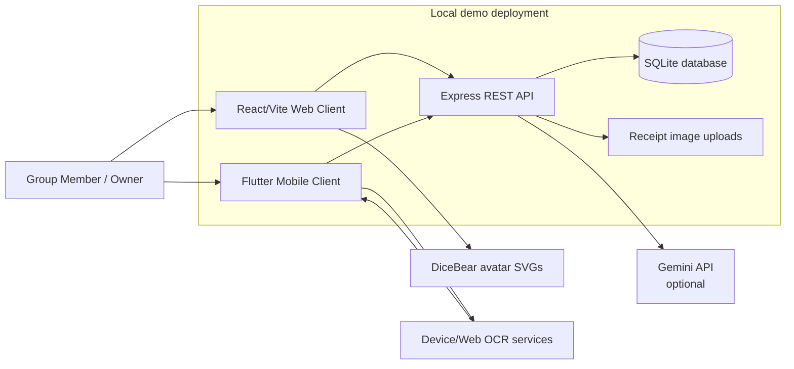
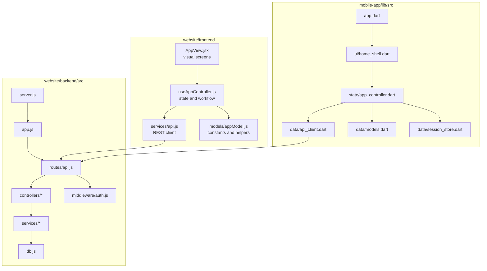
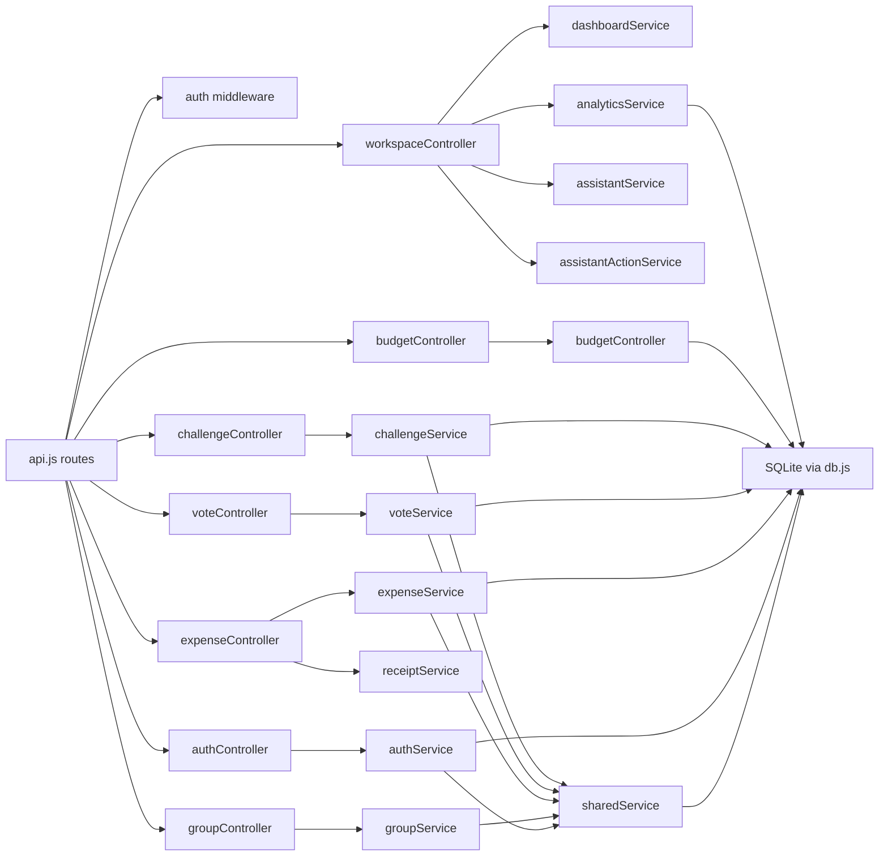
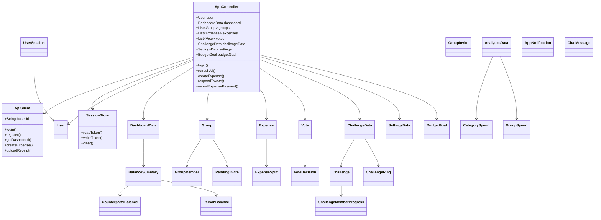
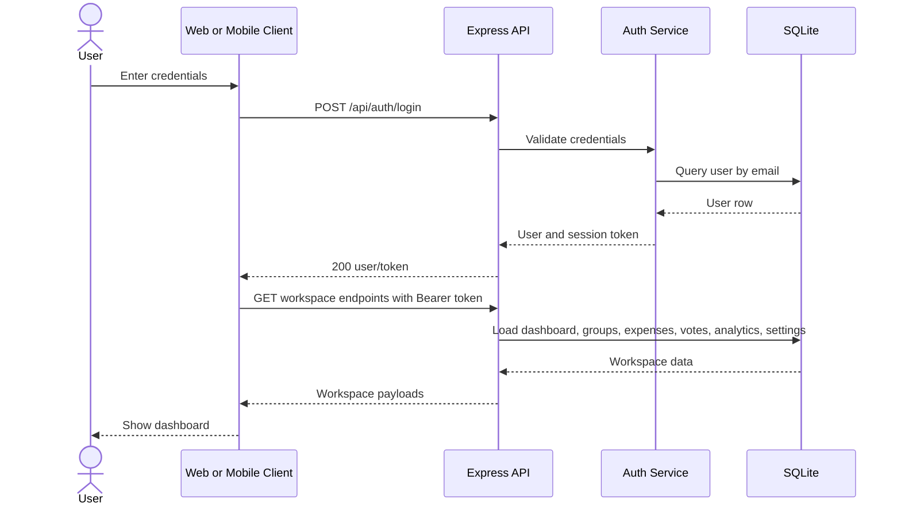
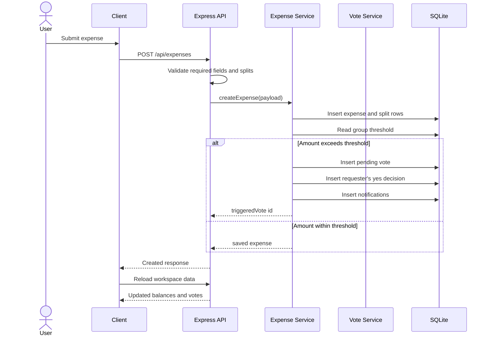
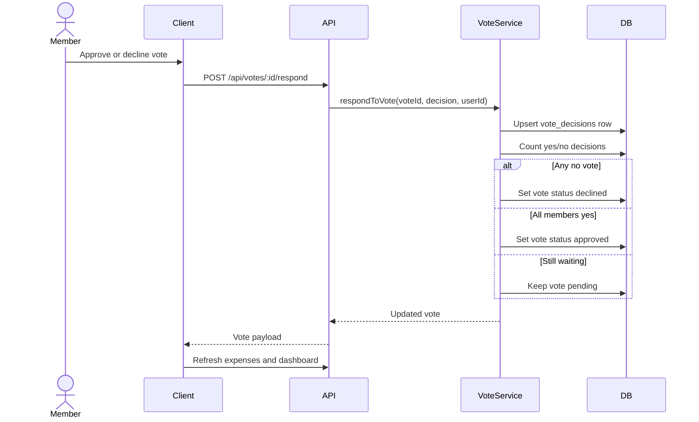
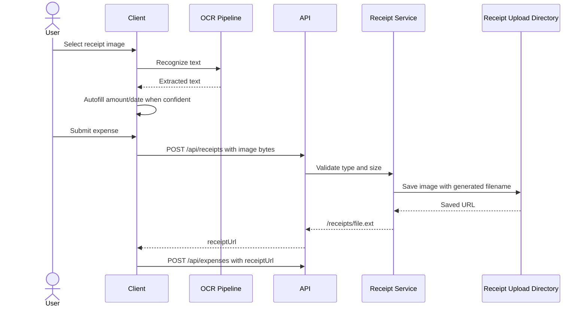
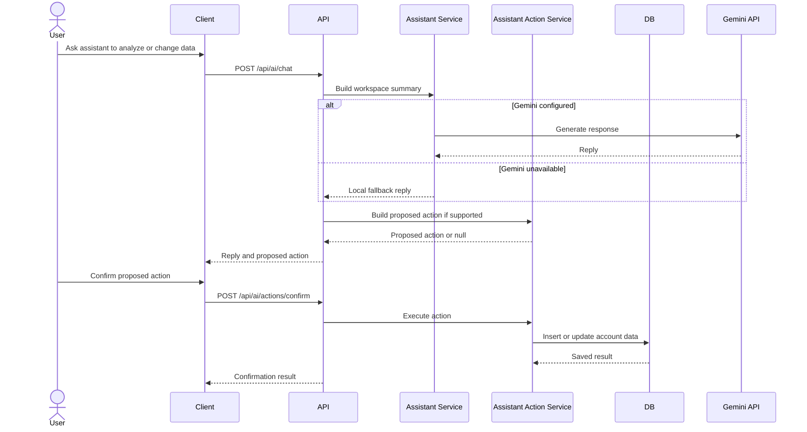

# SplitStack Technical Design Specification

Version: 1.0  
Date: May 12, 2026  
Project: SplitStack shared budgeting and expense management app

## Technical Overview

SplitStack uses a three-part architecture:

- React/Vite web client for the browser workspace.
- Flutter mobile app for mobile and desktop-supported client targets.
- Express/SQLite backend API for authentication, business logic, persistence, receipts, AI assistant calls, and shared workspace data.

The backend is the system of record. Both clients call the same REST API and use the same database-backed workflows for groups, expenses, votes, settlements, analytics, budgets, challenges, notifications, and settings.

## Technology Stack

| Layer | Technology |
| --- | --- |
| Web frontend | React 18, Vite, JavaScript, CSS |
| Mobile client | Flutter, Dart |
| Backend | Node.js 22 LTS, Express |
| Database | SQLite through `better-sqlite3` |
| Auth/session | Bearer token issued by backend |
| Receipt storage | Local backend uploads directory served at `/receipts` |
| AI assistant | Gemini API when configured, local fallback otherwise |
| OCR | Mobile/web recognition paths plus backend receipt persistence |
| Testing | ESLint, Flutter widget/unit tests, manual black-box test cases |

## Context and Deployment Diagram

## Architecture Layout

## Backend Component Diagram

## Component Responsibilities

| Component | Responsibility |
| --- | --- |
| Web `AppView` | Renders authenticated workspace, auth screens, dashboard, groups, expenses, votes, assistant, challenges, and settings. |
| Web `useAppController` | Holds web app state, validates forms, calls API methods, refreshes workspace data, and coordinates UI workflows. |
| Web `splitStackApi` | Wraps all browser REST API calls. |
| Mobile `AppController` | Central mobile state manager for auth, refresh, polling, groups, expenses, votes, budgets, challenges, settings, and chat. |
| Mobile `ApiClient` | HTTP client and JSON mapping bridge to the backend API. |
| Mobile `models.dart` | Client-side domain model classes for backend response payloads. |
| Backend controllers | HTTP request validation and response formatting. |
| Backend services | Business rules, persistence operations, calculations, notifications, AI action execution, and receipt handling. |
| `db.js` | SQLite connection, schema creation, and local bootstrap data. |

## Class Hierarchy and Relationship Diagram

The JavaScript backend is mostly organized around modules and functions. The clearest class model exists in the Flutter mobile client, where backend API payloads are represented as Dart model classes.

## Sequence Diagram: Login and Workspace Load

## Sequence Diagram: Create Expense with Voting Threshold

## Sequence Diagram: Vote Resolution

## Sequence Diagram: Receipt Upload

## Sequence Diagram: Assistant Action Confirmation

## API Surface Summary

| Area | Endpoints |
| --- | --- |
| Health/Auth | `GET /api/health`, `POST /api/auth/login`, `POST /api/auth/register` |
| Workspace | `GET /api/me`, `PUT /api/me`, `GET /api/dashboard` |
| Groups/Invites | `GET/POST/PUT/DELETE /api/groups`, `DELETE /api/groups/:id/membership`, `GET /api/invites`, `POST /api/invites/:id/respond` |
| Expenses/Receipts | `GET /api/expenses`, `POST /api/expenses`, `POST /api/receipts`, `POST /api/expenses/:id/settlements` |
| Votes | `GET /api/votes`, `POST /api/votes/:id/respond`, `DELETE /api/votes/:id/respond` |
| Analytics/Budgets | `GET /api/analytics`, `GET /api/budget`, `POST /api/budget` |
| Challenges | `GET /api/challenges`, `POST /api/challenges`, `POST /api/challenges/:id/contribute` |
| Notifications/Settings | `GET /api/notifications`, `POST /api/notifications/:id/read`, `GET /api/settings`, `PUT /api/settings` |
| Assistant | `POST /api/ai/chat`, `POST /api/ai/actions/confirm` |

## Security Design

- Authenticated routes require a Bearer token.
- Backend middleware resolves the token to a current user before protected controllers run.
- Group, invite, expense, vote, and challenge operations validate membership before reading or modifying protected group data.
- Gemini API keys are read only by the backend from `.env`, not exposed in the web or mobile bundle.
- Receipt uploads validate file type and size before storage.

## Data Persistence Design

- SQLite is used as the local system of record.
- `db.js` creates tables when the backend starts.
- Lightweight schema migration helpers add columns for newer features.
- Receipt images are stored on disk and referenced by URL in expense rows.

## Quality Attribute Notes

| Attribute | Design Support |
| --- | --- |
| Maintainability | Separate controller/service/database modules and separate web/mobile clients. |
| Portability | Local web app, Flutter mobile client, and configurable API base URLs. |
| Reliability | Backend validation for required fields, split totals, memberships, receipt types, and assistant action confirmation. |
| Usability | Dashboard-first navigation, direct group/vote/settlement flows, receipt autofill, and assistant quick replies. |
| Security | Auth middleware, membership checks, server-side AI key storage, and receipt validation. |

