# SplitStack Technical and Design Specification

Version: 1.0  
Date: May 2026  
Role Focus: Developer  
Project: SplitStack shared expense management app

## 1. Overview

The notes below cover SplitStack's deployment context, architecture, components, class relationships, sequence flows, API routes, persistence, and local build/deployment setup.

## 2. System Summary

SplitStack is implemented as three coordinated applications:

- `website/backend`: Express API with SQLite persistence through `better-sqlite3`.
- `website/frontend`: React + Vite web app.
- `mobile-app`: Flutter mobile app for iOS, Android, web, macOS, Windows, and Linux targets.

Both clients use the same backend API and the same SQLite database, which keeps the web and mobile workflows consistent.

## 3. Technology Stack

| Layer | Technology |
| --- | --- |
| Backend runtime | Node.js 22 LTS |
| Backend framework | Express 4 |
| Database | SQLite via `better-sqlite3` |
| Backend dev tooling | nodemon, ESLint |
| Web frontend | React 18, Vite |
| Mobile frontend | Flutter, Dart |
| Mobile storage | flutter_secure_storage |
| Mobile HTTP | `http` package |
| Receipt capture | Web file upload, Flutter image picker, OCR helpers |
| AI assistant | Gemini API when configured, local fallback when unavailable |

## 4. Source Layout

```text
cs4800-project/
  README.md
  docs/
    project_charter.md
    functional_requirements_specification.md
    technical_design_specification.md
    splitstack_test_case_specification.md
    project_build_deployment_instructions.md
    project_release_notes.md
    submission_artifact_checklist.md
  planning files/
    Project_Requirements_Specification (2).docx
    SplitStack_Use_Cases (1) (3).docx
    splitstack software architecture.png
    other planning/prototype PDFs and HTML files
  website/
    backend/
      src/app.js
      src/server.js
      src/db.js
      src/routes/api.js
      src/controllers/
      src/services/
      src/middleware/
    frontend/
      src/App.jsx
      src/controllers/useAppController.js
      src/models/appModel.js
      src/services/api.js
      src/views/AppView.jsx
  mobile-app/
    lib/src/app.dart
    lib/src/state/app_controller.dart
    lib/src/data/api_client.dart
    lib/src/data/models.dart
    lib/src/ui/home_shell.dart
    test/
```

## 5. Context / Deployment Diagram

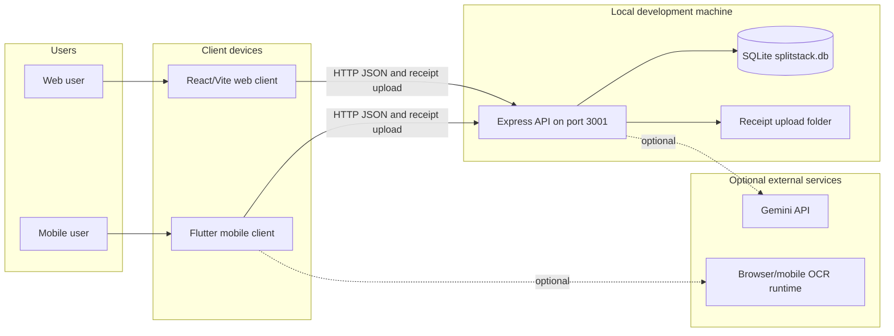

## 6. Architecture Layout

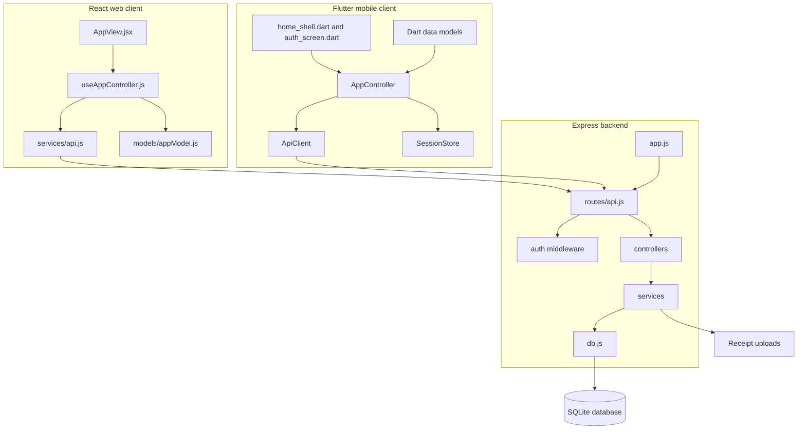

## 7. Backend Component Diagram

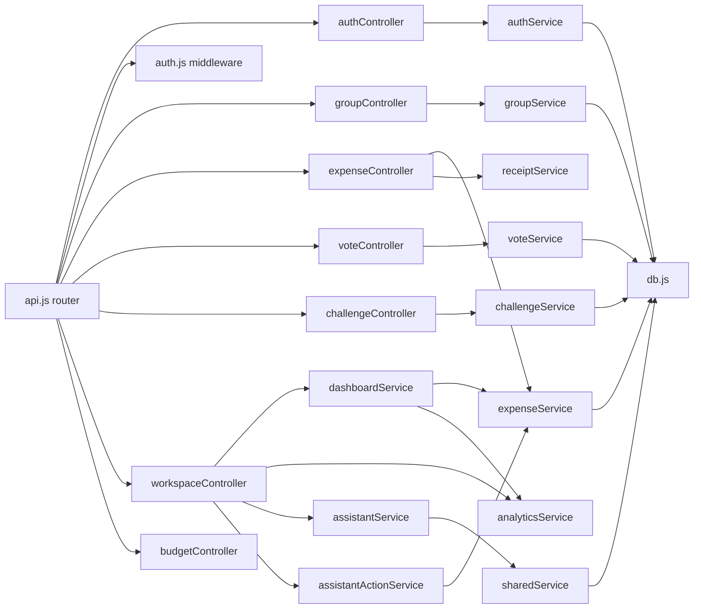

## 8. Frontend Component Diagram

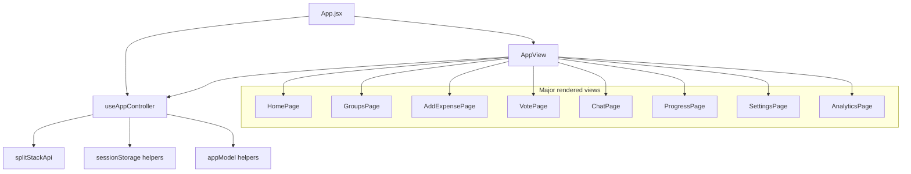

## 9. Mobile Component Diagram

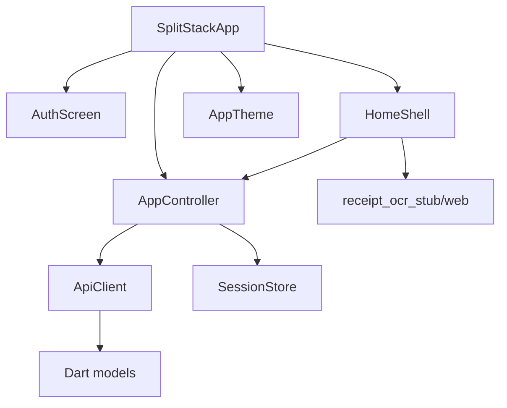

## 10. Class Hierarchy and Relationship Diagrams

### Backend Controller-Service Relationships

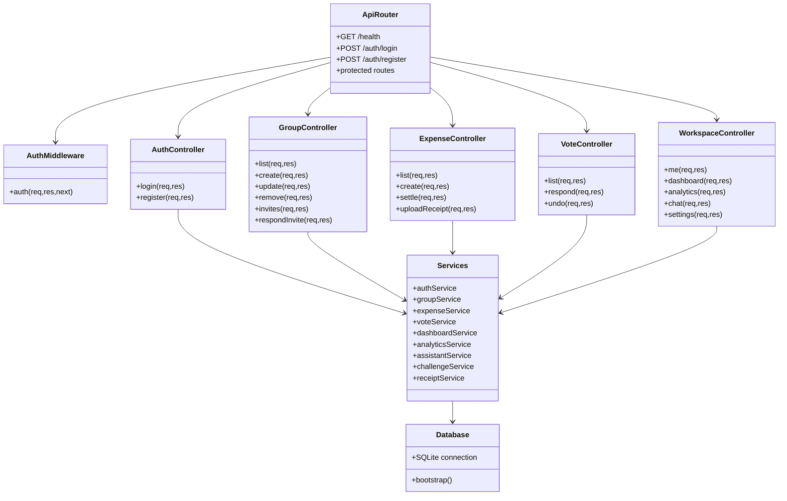

### Flutter Data Model Relationships

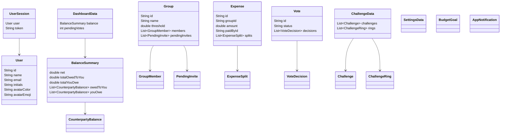

### Client Controller Relationships

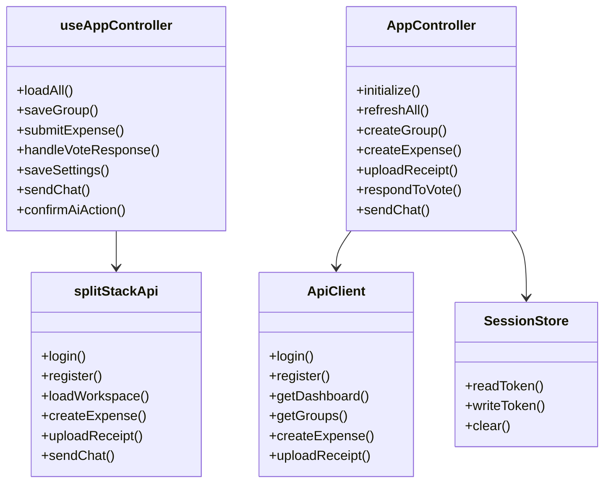

## 11. API Surface

| Method | Path | Auth | Purpose |
| --- | --- | --- | --- |
| GET | `/api/health` | No | Health check. |
| POST | `/api/auth/register` | No | Register account and return session. |
| POST | `/api/auth/login` | No | Authenticate and return session. |
| GET | `/api/me` | Yes | Load current user and invites. |
| PUT | `/api/me` | Yes | Update profile fields. |
| GET | `/api/dashboard` | Yes | Load dashboard balances, analytics, notifications, and pending vote count. |
| GET/POST | `/api/groups` | Yes | List or create groups. |
| PUT/DELETE | `/api/groups/:id` | Yes | Update or delete group. |
| DELETE | `/api/groups/:id/membership` | Yes | Leave group. |
| GET | `/api/invites` | Yes | List pending invites. |
| POST | `/api/invites/:id/respond` | Yes | Accept or decline invite. |
| GET/POST | `/api/expenses` | Yes | List or create expenses. |
| POST | `/api/receipts` | Yes | Upload receipt image bytes. |
| POST | `/api/expenses/:id/settlements` | Yes | Record settlement payment. |
| GET | `/api/votes` | Yes | List group votes. |
| POST | `/api/votes/:id/respond` | Yes | Approve or decline vote. |
| DELETE | `/api/votes/:id/respond` | Yes | Undo pending vote response. |
| GET | `/api/analytics` | Yes | Load spending analytics. |
| GET/POST | `/api/challenges` | Yes | List or create challenges. |
| POST | `/api/challenges/:id/contribute` | Yes | Add challenge contribution. |
| GET | `/api/notifications` | Yes | List notifications. |
| POST | `/api/notifications/:id/read` | Yes | Mark notification read. |
| GET/PUT | `/api/settings` | Yes | Load or update settings. |
| GET/POST | `/api/budget` | Yes | Load or save budget goal. |
| POST | `/api/ai/chat` | Yes | Ask assistant. |
| POST | `/api/ai/actions/confirm` | Yes | Execute confirmed assistant action. |

## 12. Sequence Diagrams

### Login

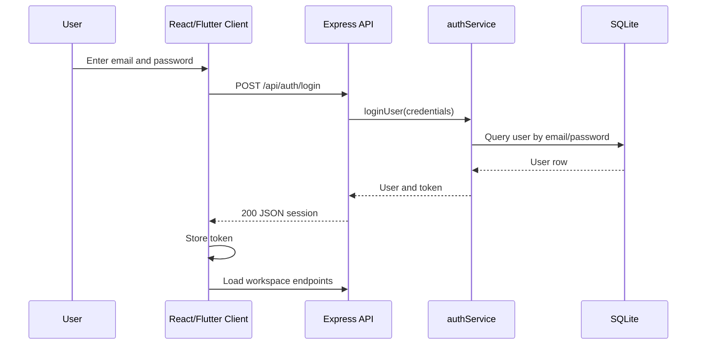

### Create Group with Invites

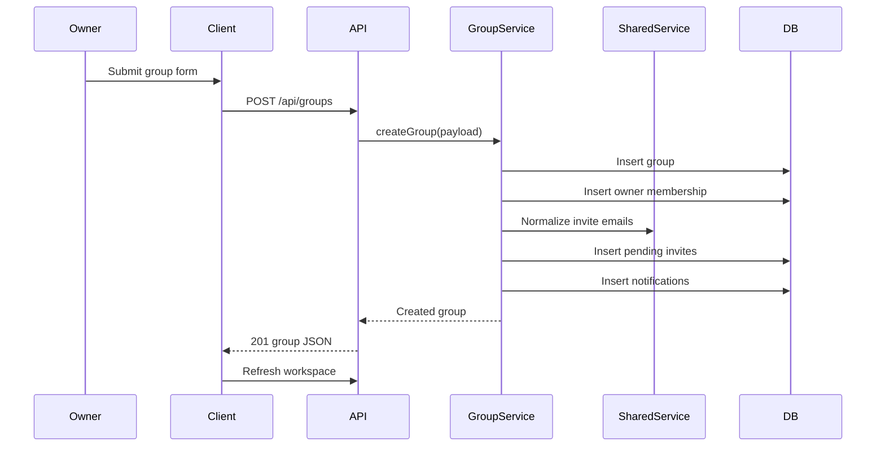

### Create Expense Below Threshold

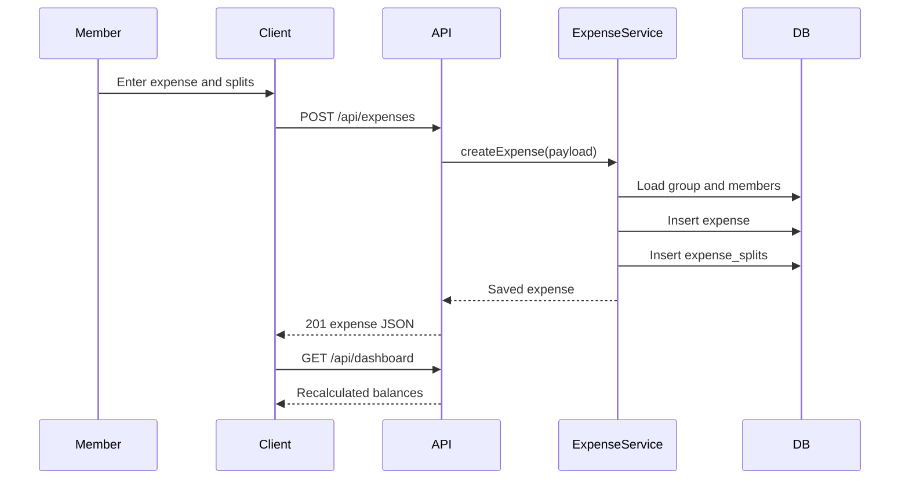

### Create Above-Threshold Expense and Vote

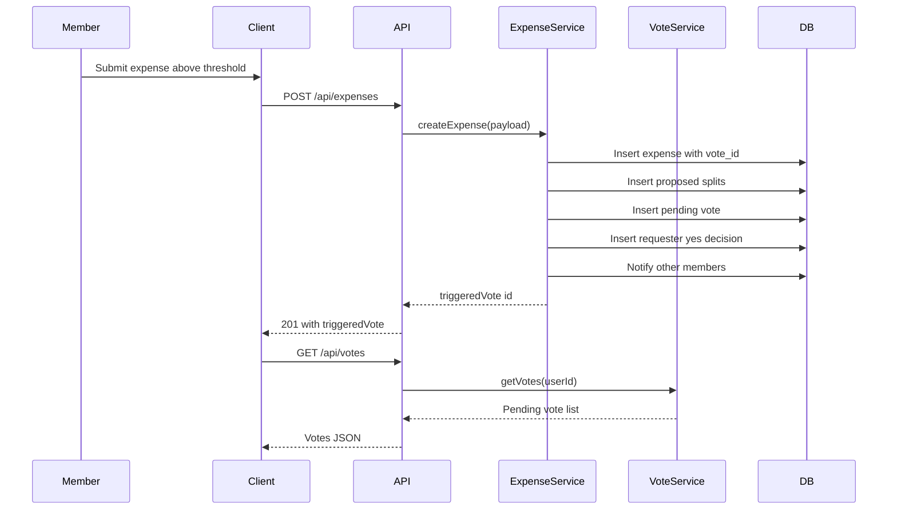

### Respond to Vote

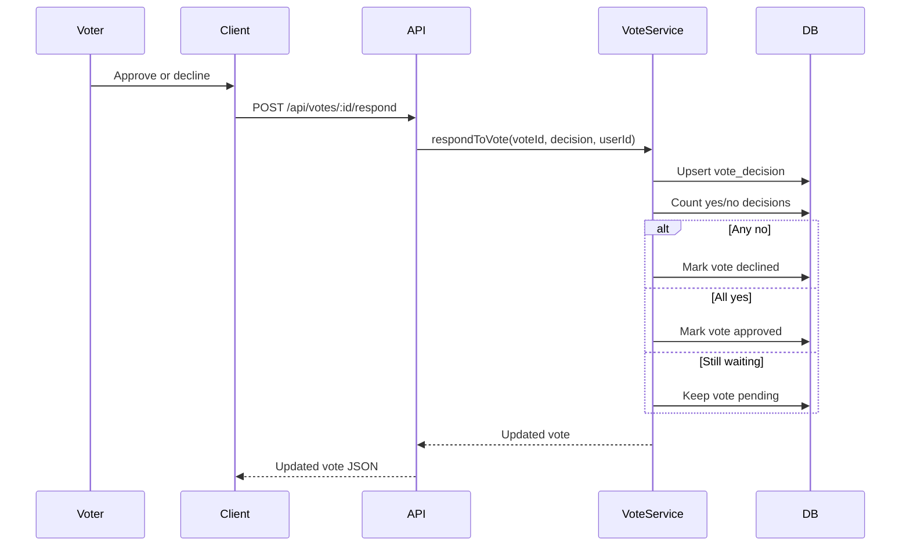

### Record Settlement

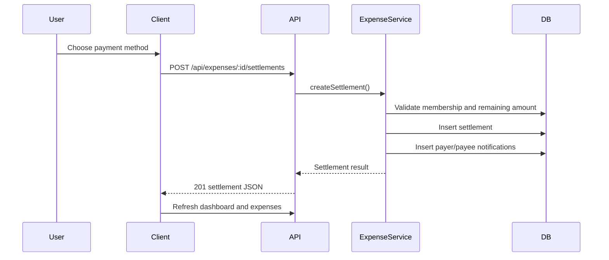

### Receipt Upload

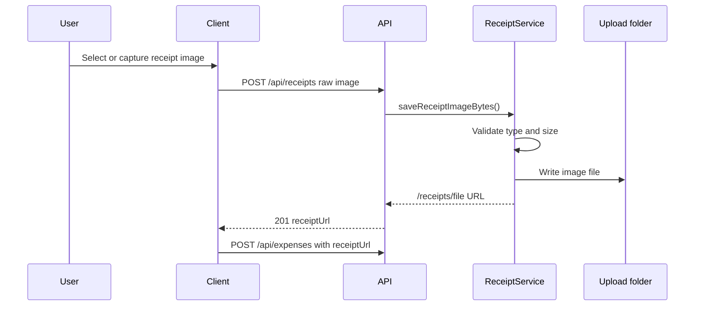

### AI Chat with Confirmed Action

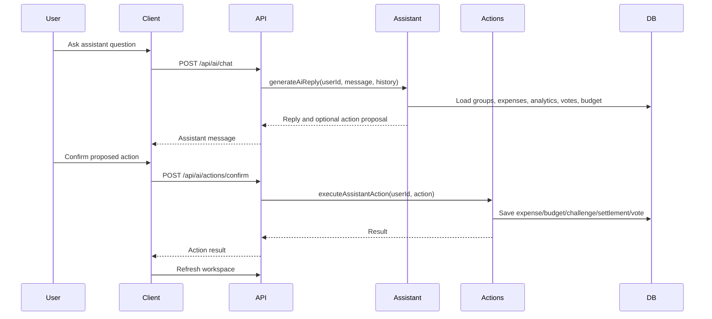

## 13. Persistence Design

The backend initializes the SQLite schema in `website/backend/src/db.js`. Tables are created if missing, and lightweight migrations add columns for existing local databases. WAL mode and foreign-key enforcement are enabled.

Main persistence groups:

- Identity: `users`, `user_settings`, `user_payout_profiles`.
- Groups: `groups_table`, `group_members`, `group_invites`.
- Ledger: `expenses`, `expense_splits`, `settlements`.
- Governance: `votes`, `vote_decisions`.
- User feedback: `notifications`.
- Goals and insights: `challenges`, `challenge_contributions`, `budget_goals`, `ai_chat_usage`.

## 14. Security Design

- Public routes are limited to health, login, and registration.
- Protected routes pass through `auth` middleware.
- Backend services check group membership before returning or mutating group data.
- Group deletion and update require owner access.
- Receipt uploads validate image signature/type and enforce size limits.
- AI actions use a confirmation endpoint before mutating data.

Prototype limitation: passwords are stored in the local SQLite database for class/demo use and should be hashed before any production deployment.

## 15. Error Handling

- Express error middleware returns JSON errors for oversized bodies, invalid JSON, and uncaught server failures.
- API helpers in React and Flutter surface backend messages to UI state.
- Receipt upload returns user-readable validation failures.
- Missing or unavailable Gemini configuration falls back to local assistant responses.

## 16. Deployment Design

The final project is intended for local development/demo deployment:

- Backend runs at `http://localhost:3001`.
- React dev server runs at `http://localhost:5173`.
- Flutter web/mobile clients point to the backend, using platform-specific default host rules.
- SQLite database is created under `website/backend/src/../splitstack.db`.
- Receipt images are stored under `website/backend/uploads/receipts`.

Detailed commands are in `docs/project_build_deployment_instructions.md`.
